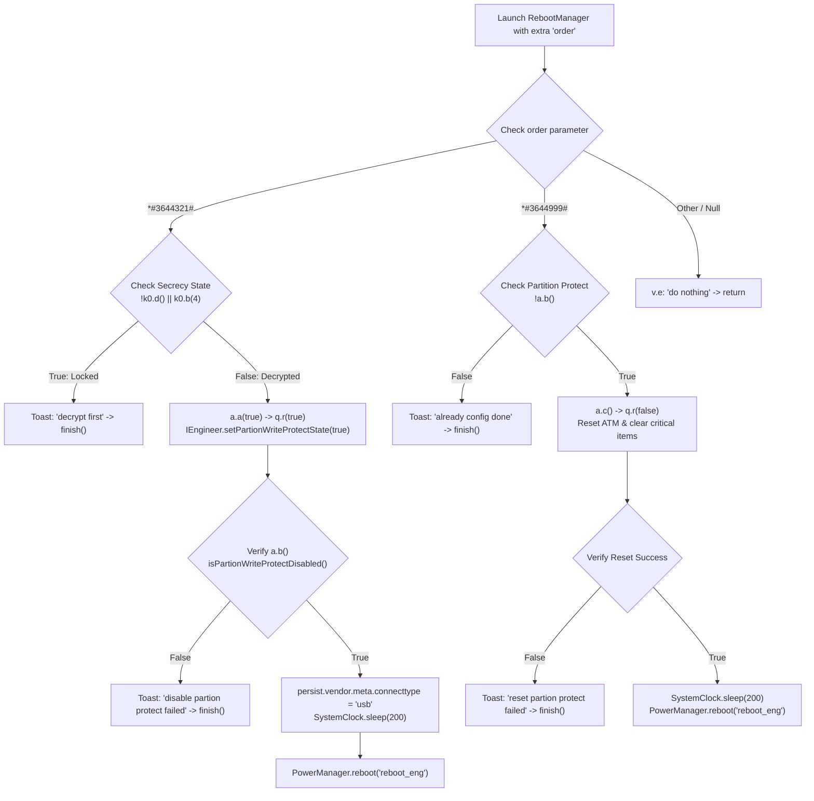

# OnePlus Watch 3 (OPWWE251) - RebootManager Analysis

## Overview

`RebootManager` (`com.oppo.engineermode.RebootManager`) is the gatekeeper activity responsible for toggling system partition write protection, transitioning USB diagnostic endpoints, and rebooting into Qualcomm Engineering Test Mode (`reboot_eng`).

The source implementation was reverse engineered from `HeyEngineerModeHuaQin.apk` and is stored at [`reports/engineer_mode/reboot_manager.java`](file:///home/zek/Pobrane/opw3%20firmware/reports/engineer_mode/reboot_manager.java).

---

## Detailed Execution Flows



---

## Code Breakdown

### 1. The MTK/Qualcomm Engineering Mode Code: `*#3644321#`

When dialed or triggered with intent extra `order="*#3644321#"`:

```java
if (!k0.d() || k0.b(4)) {
    v.e("RebootManager", "decrypt first");
    Toast.makeText(this, "decrypt first", 1).show();
    finish();
    return;
}
```

1. **Secrecy Validation:**
   - `k0.d()`: Queries `ISecrecyService.isSecrecySupport()`. Must be `true`.
   - `k0.b(4)`: Queries `ISecrecyService.getSecrecyState(4)` (where 4 represents `SECRECY_TYPE_ADB`). If state 4 is locked (`true`), execution stops with the toast **`"decrypt first"`**.
2. **Disabling Write Protection:**
   - Calls `com.oppo.engineermode.util.a.a(true)`:
     ```java
     public static boolean a(boolean z8) {
         return q.r(z8); // calls IEngineer.setPartionWriteProtectState(z8)
     }
     ```
   - Verifies whether write protection is disabled using `com.oppo.engineermode.util.a.b()` (`IEngineer.getPartionWriteProtectState()`).
3. **USB Mode Configuration:**
   - Sets property `persist.vendor.meta.connecttype=usb`.
4. **Reboot:**
   - Waits 200 ms and executes `PowerManager.reboot("reboot_eng")`.
   - This passes the `reboot_eng` boot reason argument through Android `init` to the Qualcomm bootloader (`abl.elf` / `xbl.elf`), enabling factory test interfaces during the subsequent boot cycle.

---

### 2. The Partition Protect Reset / Restore Code: `*#3644999#`

When dialed with `order="*#3644999#"`:

1. **State Check:**
   - Checks `!com.oppo.engineermode.util.a.b()`. If write protection is already enabled (normal state), toasts `"already config done"` and exits.
2. **Restoring Write Protection & Resetting ATM:**
   - Calls `com.oppo.engineermode.util.a.c()`:
     - Calls `q.r(false)` (`IEngineer.setPartionWriteProtectState(false)`).
     - Sets system properties `vendor.oppo.quit.atm=true` and `vendor.oppo.engineer.usb.config=adb`.
     - Clears factory test critical records:
       ```java
       b0.a(101);   // cleans item 101
       b0.a(1125);  // cleans item 1125
       b0.e();      // syncCacheToEmmc()
       ```
3. **Reboot:**
   - On success, sleeps 200 ms and reboots into normal production mode via `powerManager.reboot("reboot_eng")`.

---

## The "Decrypt First" Barrier

The primary gate blocking unauthorized developers or repair shops from entering `reboot_eng` is `k0.b(4)`.
To pass this check, the device must have unlocked Secrecy privileges through:
1. **Employee Decryption (`EmployeeDecryptionMethodActivity`):** Requires active intranet credentials to authenticate against OnePlus internal servers (`c4.a.b().c()`).
2. **Auth Token Decryption (`AuthTokenDecryptionMethodActivity`):** Uses an offline challenge-response cryptographic token generated via `dumpsys secrecy -config imei=<IMEI>.unlock_type=id.encrypt_all=false.stamp=<timestamp>`, signed by OnePlus proprietary RSA private keys and verified by native library `l.a()`.

Without satisfying one of these methods, the HAL call to disable write protection is unreachable via the standard UI flow.
