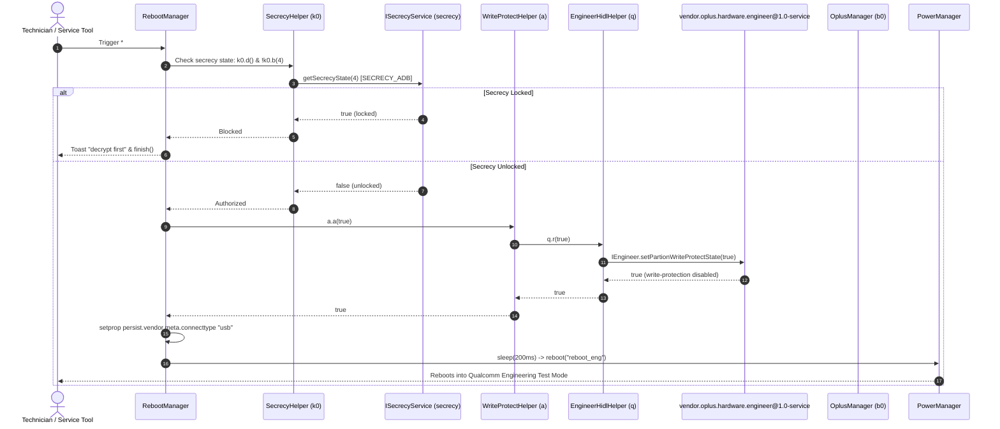
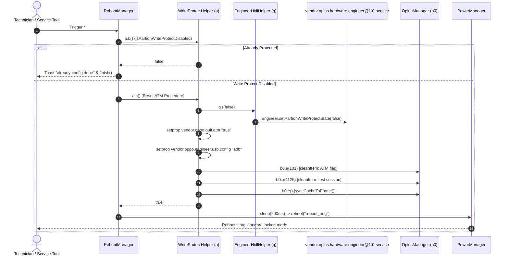

# OnePlus Watch 3 (OPWWE251) - Partition Write-Protect Flow

## Overview

Disabling write protection on OnePlus devices allows persistent modifications to read-only partitions (`system`, `vendor`, `product`, `system_ext`) during factory servicing. On the OnePlus Watch 3 (OPWWE251), this flow is orchestrated between `HeyEngineerMode`, the `OplusManager` framework service, and the `vendor.oplus.hardware.engineer@1.0` HAL daemon.

---

## Architecture Flow Diagram



---

## Detailed Step-by-Step Breakdown

### Phase 1: Authentication & Secrecy Check
1. The execution enters `RebootManager.onCreate()` with `order="*#3644321#"`.
2. `RebootManager` invokes `k0.d()` to verify if Secrecy is supported, and `k0.b(4)` to check the authorization status of the ADB debug channel.
3. If Bit 4 is set, access is denied immediately with `"decrypt first"`.

### Phase 2: Calling the HAL Layer
1. `com.oppo.engineermode.util.a.a(true)` is invoked.
2. Helper method `a.a` delegates to `com.oppo.engineermode.util.q.r(true)`.
3. Method `q.r` obtains the HIDL proxy handle to `vendor.oplus.hardware.engineer.V1_0.IEngineer` and calls:
   ```java
   IEngineer.setPartionWriteProtectState(true);
   ```
4. The HAL daemon (`vendor.oplus.hardware.engineer@1.0-service`) handles the request:
   - Modifies eMMC / UFS controller write-protect flags via proprietary vendor ioctl or sysfs interfaces.
   - Clears dm-verity verification flags in memory for the active session.

### Phase 3: Transition to Engineering Mode
1. `RebootManager` verifies successful execution by polling `a.b()` (`IEngineer.getPartionWriteProtectState()`).
2. If confirmed, property `persist.vendor.meta.connecttype` is set to `"usb"`.
3. `PowerManager.reboot("reboot_eng")` is called.
4. Android `init` handles the property change and signals the Qualcomm bootloader (`abl.elf`) to load the engineering environment.

---

## Write-Protect Restoration & ATM Mode Reset Flow

To restore write protection and exit After-sales Test Mode (ATM), the inverse code `*#3644999#` is executed:


