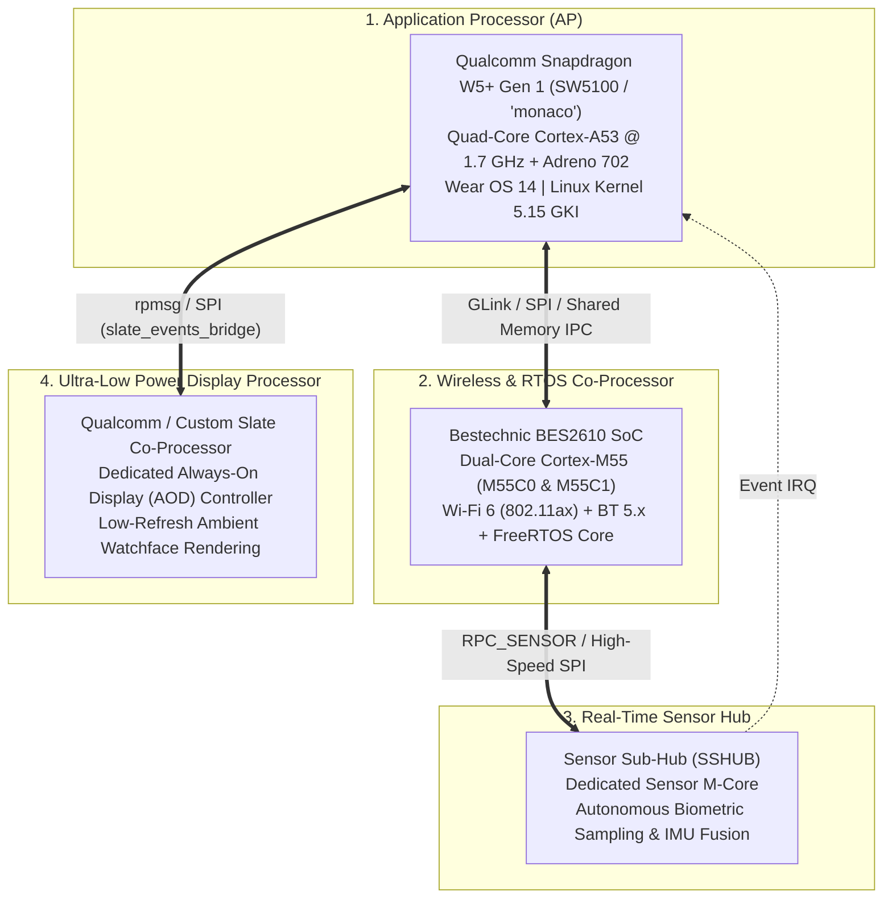

# OnePlus Watch 3 (OPWWE251) - 4-Processor Hardware Architecture

## Executive Architecture Summary

The OnePlus Watch 3 (OPWWE251) utilizes a sophisticated **heterogeneous 4-processor architecture**. This multi-chip design distributes real-time sensing, wireless connectivity, ambient display rendering, and heavy application computing across dedicated processors to maximize battery life while maintaining high performance.

---

## Detailed Processor Breakdown

### 1. Application Processor (AP): Qualcomm Snapdragon W5+ Gen 1 (SW5100 "monaco")

- **Role:** Heavy computing, Android runtime (ART), graphical user interface rendering, user apps, Wear OS services, voice assistant, cellular modem management.
- **CPU/GPU:** 4x ARM Cortex-A53 up to 1.7 GHz, Adreno 702 GPU.
- **Operating System:** Wear OS 14 (Android 14 GKI, Linux kernel 5.15.170-android14-11-ge97c0f1666c8-ab12933924).
- **Key Kernel Modules (`vendor_dlkm` / `vendor_boot`):**
  - `msm_video.ko` (3,170 symbols): Hardware video decoding/encoding (H.264, H.265, VP9, Venus HFI).
  - `oplus_ddr_freq.ko` (74 symbols): Interconnect bandwidth and LPDDR4X dynamic frequency scaling (`icc_set_bw`).
  - `qcom_glink_*.ko` / `glink_*.ko`: Qualcomm Generic Link IPC bus communicating with TrustZone (`tz.mbn`), RPM (`rpm.mbn`), and modem (`NON-HLOS.bin`).
  - `qpnp-smblite-main.ko` & `qti-qbg-main.ko`: PMIC charging controller and battery fuel gauge.
  - `oplus_shutdown_detect.ko`: Watchdog monitor for orderly system shutdowns.
- **Hardware Interfaces:** UFS 2.2 / eMMC storage, high-speed MIPI DSI, SPMI power management bus.
- **Modding Significance:**
  - Primary target for kernel development, root exploits (KernelSU, Magisk), and Wear OS custom ROMs.
  - Runs in single-slot configuration (`A-only`, no A/B partitions).

---

### 2. Wireless & RTOS Co-Processor: Bestechnic BES2610

- **Role:** Handles high-throughput Wi-Fi 6 (802.11ax), Bluetooth 5.x audio/data connections, and serves as the secondary operating system when the Snapdragon AP enters deep low-power sleep (C-states).
- **Architecture:** Tri-core ARM Cortex-M architecture with dual M55 cores (`M55C0`, `M55C1`) and 8 MB on-board NOR Flash.
  - `M55C0`: Executes RTOS system services, UI offload, GNSS/GPS navigation logging (`gps_gnss_service_sensor_send_m55_msg`).
  - `M55C1`: DSP physical layer processing for 802.11ax baseband and Bluetooth audio codecs.
- **Key Kernel Modules:**
  - `bes2610.ko` (9,163 symbols): Full Linux `cfg80211` network driver for dual-band Wi-Fi 6.
  - `oplus_comm_master.ko` (396 symbols): Host IPC driver managing MCU lifecycle (`FIRST`, `NORMAL`, `CRASH`, `DUMP`), crash dump extraction, and heartbeat watchdog (`auto_reset_mcu`).
  - `oplus_comm_master_bt.ko` (749 symbols): Bluetooth HCI transport bridge over high-speed UART.
- **APIs & Framework Bridges:**
  - `vendor.oplus.hardware.transfer@1.0::ITransfer` (`ATMWiFiHidlServer`).
  - `vendor.oplus.hardware.wifi::IOplusWifiService`.
  - MCU framing protocol (64 binary commands).
- **Modding Significance:**
  - Essential for all wireless operations. If a custom kernel lacks `bes2610.ko` or `oplus_comm_master.ko`, Wi-Fi and Bluetooth become completely inoperable.
  - Firmware updating occurs via `*#*#700#` (`McuUpgradeActivity`).

---

### 3. Dedicated Sensor Sub-Hub (SSHUB)

- **Role:** 24/7 continuous health tracking, motion counting, pedometer calculations, biometric arrhythmia monitoring, and hardware rotary crown tracking.
- **Hardware Peripherals Controlled by SSHUB:**
  - **Motion:** InvenSense `icm42631` and STMicroelectronics `lsm6dso` 6-axis IMUs.
  - **Biometrics:** Optical photoplethysmography (PPG) array with active motion artifact cancellation (`acc_gyro_ppg_sync`).
  - **Skin Temperature:** Medical thermistor array (`wrist_temperature`).
  - **Digital Crown:** Rotary encoder controllers (`mixosense,mot6010` on I2C `0x74`, `pixart,pat9125` on I2C `0x75`, IRQ GPIO 56).
  - **Capacitive Wear Detection:** Off-wrist optical & capacitive sensing.
- **Key Kernel Modules:**
  - `oplus_snshub.ko` (279 symbols): Generates Linux `uevent` notifications and bridges sensor events to Android userspace.
  - `oplus_crown.ko` (442 symbols): Handles digital crown input events, rotation steps, and haptic feedback detents.
  - `haptic.ko` (1,484 symbols): Awinic AW86927 linear resonant actuator driver supporting "haptic audio" (synthesized tactile vibrations).
- **APIs & Framework Bridges:**
  - `android.hardware.sensors@2.1-service`.
  - `vendor.google_clockwork.healthservices::IHealthServices`.
  - `vendor.google_clockwork.wristorientation@1.0::IWristOrientation`.
- **Modding Significance:**
  - Health algorithms execute on SSHUB/M55C0 independently of Wear OS. Flashing a custom Android build does not disrupt step counting or heart rate tracking as long as sensor IPC is maintained.

---

### 4. Display & Ambient Controller: Slate Coprocessor

- **Role:** Manages the Always-On Display (AOD) ambient mode. Drives the 1.43" AMOLED panel at ultra-low refresh rates (1 Hz - 10 Hz) while drawing minimal power, allowing the Snapdragon AP and GPU to remain powered down.
- **Hardware Integration:**
  - Interfaced via dedicated SPI bus and low-latency interrupt lines.
  - Manages display controller chips (e.g., FocalTech FT2390 / Chipone ICNA3311 across DTBO overlays 02-09).
  - Monitors touch wake-up lines (`focaltech,fts` on I2C `0x38`, `zinitix,bt541_ts_device` on I2C `0x20`, IRQ GPIO 13).
- **Key Kernel Modules:**
  - `slate_events_bridge.ko` (183 symbols): Linux kernel event bridge for ambient display triggers.
  - `slate_events_bridge_rpmsg.ko` (93 symbols): RPMsg IPC communication protocol between Android kernel and the Slate coprocessor.
- **APIs & Framework Bridges:**
  - `vendor.google_clockwork.displayoffload@2.0::IDisplayOffload`.
- **Modding Significance:**
  - Generic Android (GSI) builds lack the Google Clockwork `displayoffload` HAL and `slate_events_bridge_rpmsg` bindings. Without these, the device cannot drop into low-power AOD mode, resulting in severe standby battery drain.

---

## Inter-Processor Bus Matrix

| Source Processor | Target Processor | Physical Bus | Protocol / Transport | Purpose |
| :--- | :--- | :--- | :--- | :--- |
| **Snapdragon AP** | **BES2610 RTOS** | High-Speed SPI / UART | Oplus Comm Master / Framing | Command dispatch, Wi-Fi data, BT audio |
| **Snapdragon AP** | **Slate** | SPI / GPIO | RPMsg / Slate Events Bridge | AOD watchface offload, ambient tick updates |
| **Snapdragon AP** | **Snapdragon RPM/Modem** | SPMI / Shared RAM | Qualcomm GLink / SMD | Power management, baseband telemetry |
| **BES2610 (M55C0)**| **SSHUB** | Internal Bus / SPI | RPC_SENSOR | Sensor raw stream & motion sync |
| **SSHUB** | **Sensors (PPG, IMU)**| I2C / SPI | Direct register I/O | Real-time biometrics & rotary crown detents |
