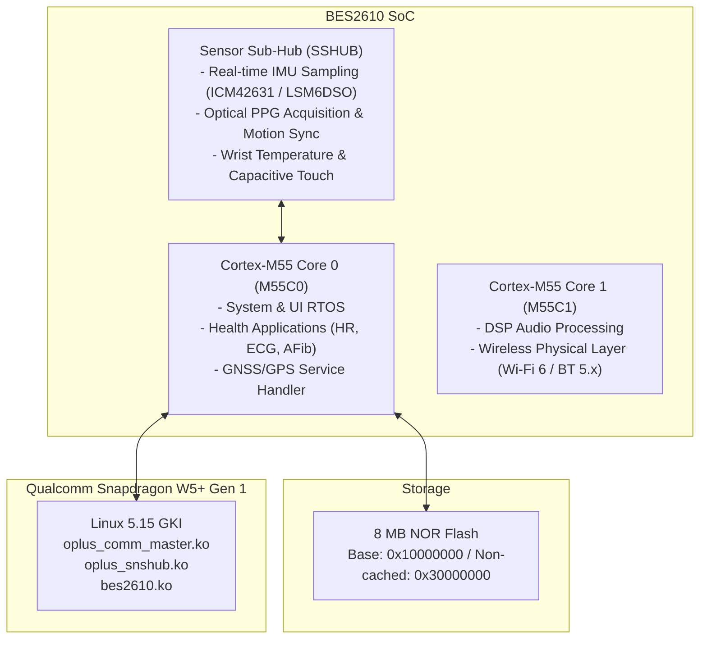

# Bestechnic BES2610 RTOS Firmware Analysis

## Overview

The OnePlus Watch 3 (OPWWE251) employs a dual-operating system, multi-chip architecture. While the primary application processor is the Qualcomm Snapdragon W5+ Gen 1 (SW5100 "monaco") running Wear OS 14 (Linux Kernel 5.15 GKI), all real-time background processing, health tracking, sensor polling, Bluetooth Low Energy (BLE), and Wi-Fi 6 (802.11ax) baseband operations are handled by the **Bestechnic BES2610** wireless micro-controller unit (MCU).

The RTOS binaries are located in the repository under [`mcu_firmware/OPWWE251/`](file:///home/zek/Pobrane/opw3%20firmware/mcu_firmware/OPWWE251/).

---

## 1. Multi-Core RTOS Architecture

The BES2610 system-on-chip features a tri-core ARM Cortex-M architecture with integrated PSRAM and dedicated hardware cryptographic accelerators:



### Binary Components in `mcu_firmware/OPWWE251/`
1. **`OPWWE251_M55C0_2505201801.bin`** (Core 0 Image):
   Contains the main FreeRTOS/RTOS system scheduler, application state machines, watchface rendering on ultra-low power display, and higher-level biometric algorithms.
2. **`OPWWE251_M55C1_2505201801.bin`** (Core 1 Image):
   Contains digital signal processing (DSP) filters, Wi-Fi 6 baseband firmware, and audio streaming pipelines.
3. **`OPWWE251_SSHUB_2505201801.bin`** (Sensor Hub Image):
   High-frequency hardware interrupt service routines for motion sensors, optical PPG diodes, and environmental transducers.
4. **`bootloader.bin`** (MCU Primary Bootloader):
   Handles low-level hardware initialization, flash memory verification, and emergency UART recovery.
5. **`programmer.bin`** (MCU Flash Programmer):
   Executable tool payload transferred into MCU SRAM by host tools during factory flashing.

---

## 2. Health & Biometric Processing in RTOS

Static string analysis of the MCU binaries proves that **biometric sensors are not polled directly by the Linux kernel**. Instead, continuous health tracking runs autonomously on the BES2610 even when the Snapdragon AP is suspended in deep sleep:

### Key Health Subsystems Uncovered:
- **Optical Photoplethysmography (PPG):**
  - Applications: `heart_rate_app`, `heart_rate_notify_app`, `heart_rate_srv`, `heart_rate_card`.
  - Motion Cancellation Sync: `acc_gyro_ppg_sync` synchronizes sampling intervals between the 6-axis IMU (`icm42631` / `lsm6dso`) and PPG optical receivers to remove walking/running motion noise from pulse calculations.
- **Atrial Fibrillation (AFib) Detection:**
  - Function: `heart_rate_atrial_fibrillation_app`, `heart atrial fibrillation`.
  - Real-time pulse irregularity analysis runs in the background. In retail consumer Wear OS builds, this feature is geographically gated by region configuration (currently disabled in Poland / EU markets).
- **Skin / Wrist Temperature Monitoring:**
  - Functions: `wrist_temperature`, `wrist_temp_srv`, `wrist_temperature_app`, `rx_wrist_temperature`, `wrist_temp_impl_read`.
  - Reads medical-grade thermistor data for sleep tracking and temperature trend monitoring.
- **Pedometer & Activity Tracking:**
  - Functions: `step_complete`, `act_step_completed`.
  - Computes steps, active calories, and cadence entirely within the RTOS.
- **GPS / GNSS Offloading:**
  - Function: `gps_gnss_service_sensor_send_m55_msg`, `GPS_GNSS`.
  - Navigation telemetry is processed by M55C0 during workouts, enabling battery-efficient route logging without waking the Linux application processor.

---

## 3. Sensor Hub Communication & AT Commands

The SSHUB firmware includes an internal AT command interpreter and RPC mechanism:
- **`sensor_hub_atcmd_task` / `atcmd_sensor_hub_handler`:**
  Executes diagnostic test commands dispatched from Engineer Mode.
- **`RPC_SENSOR`:**
  Remote Procedure Call messaging layer exchanging sensor telemetry structures between SSHUB and M55C0.
- **Kernel Bridge (`oplus_snshub.ko` & `oplus_comm_master.ko`):**
  The Linux kernel communicates with the BES2610 across SPI/UART high-speed buses. State transitions (`FIRST`, `NORMAL`, `CRASH`, `DUMP`) and automatic reset routines (`auto_reset_mcu`) are handled by `oplus_comm_master.ko`.

---

## 4. RTOS Bootloader & Flash Programmer Architecture

The primary bootloader (`bootloader.bin`) implements a robust flash programming protocol for the on-board 8 MB NOR Flash:

```text
NOR Flash Configuration:
- Base Address:      0x10000000
- Non-Cached Base:   0x30000000
- Flash Size:        0x800000 (8,388,608 Bytes / 8 MB)
- Hardware Pin:      upg_mode_pin (Upgrade Mode Entry Pin)
- Protocol:          UART / SPI Packet Framing
```

### Supported Flash Commands:
- `GET_FLASH_ID`: Reads 3-byte JEDEC manufacturer and memory type identifier.
- `GET_FLASH_SIZE`: Queries total storage capacity.
- `ERASE_DATA`: Performs sector or chip erase.
- `BURN_DATA`: Writes firmware binary pages to flash.
- `VERIFY_DATA`: Computes CRC/checksum to validate integrity.
- `SEC_VERIFY/EXTRA`: Validates RSA/ECDSA cryptographic signatures before booting newly flashed images.

---

## 5. Complete MCU Command Protocol (64 Commands)

The host application processor exchanges framed binary messages with the BES2610 RTOS. The complete command specification extracted from `mcu_commands.txt` contains 64 defined values:

| Value | Host-to-MCU Command (`MSG_HOST_*`) | MCU-to-Host Response (`MSG_MCU_*`) | Subsystem Description |
| :---: | :--- | :--- | :--- |
| `0` | `MSG_MMI_UNSPECIFIED_VALUE` | - | Unspecified / Null command |
| `1 / 2` | `MSG_HOST_MMI_SENSOR_READ_VALUE` | `MSG_MCU_MMI_SENSOR_RESPONSE_VALUE` | Read real-time sensor register values |
| `3 / 4` | `MSG_HOST_MMI_PPG_CMD_VALUE` | `MSG_MCU_MMI_PPG_RSP_VALUE` | Optical PPG sensor configuration & raw stream |
| `5 / 6` | `MSG_HOST_MMI_ECG_CMD_VALUE` | `MSG_MCU_MMI_ECG_RSP_VALUE` | ECG front-end amplifier control & telemetry |
| `7 / 8` | `MSG_HOST_MMI_LCD_CMD_VALUE` | `MSG_MCU_MMI_LCD_RESPONSE_VALUE` | Ultra-low power RTOS display controller |
| `9 / 10` | `MSG_HOST_MMI_FLASH_CMD_VALUE` | `MSG_MCU_MMI_FLASH_RESPONSE_VALUE` | MCU NOR Flash read/write/erase command |
| `11 / 12`| `MSG_HOST_MMI_BLE_CMD_VALUE` | `MSG_MCU_MMI_BLE_RESPONSE_VALUE` | Bluetooth Low Energy stack commands |
| `13 / 14`| `MSG_HOST_MMI_PRESSURE_CMD_VALUE` | `MSG_MCU_MMI_PRESSURE_RESPONSE_VALUE` | Barometric pressure sensor (altimeter) |
| `15 / 16`| `MSG_HOST_MMI_ACC_CALIB_CMD_VALUE` | `MSG_MCU_MMI_ACC_CALIB_RESPONSE_VALUE`| Accelerometer offset calibration |
| `17 / 18`| `MSG_HOST_MMI_GYRO_CALIB_CMD_VALUE`| `MSG_MCU_MMI_GYRO_CALIB_RESPONSE_VALUE`| Gyroscope bias calibration |
| `19 / 20`| `MSG_HOST_MMI_CAP_CALIB_CMD_VALUE` | `MSG_MCU_MMI_CAP_CALIB_RESPONSE_VALUE`| Capacitive off-body / wear detection calib |
| `21 / 22`| `MSG_HOST_MMI_LIGHTSENSOR_CALI_CMD_VALUE`| `MSG_MCU_MMI_LIGHTSENSOR_CALI_RESPONSE_VALUE`| Ambient light sensor (ALS) calibration |
| `23 / 24`| `MSG_HOST_MMI_MOTOR_CMD_VALUE` | `MSG_MCU_MMI_MOTOR_RESPONSE_VALUE` | AW86927 haptic linear motor actuation |
| `25 / 26`| `MSG_HOST_MMI_KEY_CMD_VALUE` | `MSG_MCU_MMI_KEY_RESPONSE_VALUE` | Physical side push-button event handling |
| `27 / 28`| `MSG_HOST_MMI_ALGO_CMD_VALUE` | `MSG_MCU_MMI_ALGO_RESPONSE_VALUE` | Biometric algorithm execution & parameters |
| `29 / 30`| `MSG_HOST_MMI_TP_CMD_VALUE` | `MSG_MCU_MMI_TP_RESPONSE_VALUE` | Touch panel controller low-power events |
| `31 / 32`| `MSG_HOST_MMI_AGING_TEST_PPG_CMD_VALUE`| `MSG_MCU_MMI_AGING_TEST_PPG_RSP_VALUE`| PPG burn-in / continuous stress test |
| `33 / 34`| `MSG_HOST_MMI_AGING_TEST_ECG_CMD_VALUE`| `MSG_MCU_MMI_AGING_TEST_ECG_RSP_VALUE`| ECG burn-in / continuous stress test |
| `35 / 36`| `MSG_HOST_MMI_POWEROFF_REQ_VALUE` | `MSG_MCU_MMI_POWEROFF_RSP_VALUE` | Low-power sleep / shutdown request |
| `37 / 38`| `MSG_HOST_MMI_PSRAM_CMD_VALUE` | `MSG_MCU_MMI_PSRAM_RESPONSE_VALUE` | MCU external PSRAM memory diagnostics |
| `39 / 40`| `MSG_HOST_MMI_ALGO_CONTROL_VALUE` | `MSG_MCU_MMI_ALGO_CONTROL_RSP_VALUE` | Start/stop background health algorithms |
| `41 / 42`| `MSG_HOST_MMI_FS_CMD_VALUE` | `MSG_MCU_MMI_FS_RESPONSE_VALUE` | MCU internal flash filesystem operations |
| `43 / 44`| `MSG_HOST_MMI_DIGITAL_CROWN_CMD_VALUE`| `MSG_MCU_MMI_DIGITAL_CROWN_RESPONSE_VALUE`| Rotary encoder crown sensor (`mot6010`/`pat9125`) |
| `45 / 46`| `MSG_HOST_MMI_NTC_CMD_VALUE` | `MSG_MCU_MMI_NTC_RESPONSE_VALUE` | Battery / board NTC temperature thermistor |
| `47 / 48`| `MSG_HOST_MMI_AUDIO_CMD_VALUE` | `MSG_MCU_MMI_AUDIO_RESPONSE_VALUE` | Low-power audio codec / beeper control |
| `49 / 50`| `MSG_HOST_MMI_MIC_CMD_VALUE` | `MSG_MCU_MMI_MIC_RESPONSE_VALUE` | Digital microphone loopback & calibration |
| `51 / 52`| `MSG_HOST_MMI_WRISTTEMP_CMD_VALUE` | `MSG_MCU_MMI_WRISTTEMP_RESPONSE_VALUE` | Skin temperature measurement readout |
| `53 / 54`| `MSG_HOST_MMI_OVERLOAD_CMD_VALUE` | `MSG_MCU_MMI_OVERLOAD_RESPONSE_VALUE` | MCU CPU overload & queue stress monitor |
| `55 / 56`| `MSG_HOST_AGING_TEST_CMD_VALUE` | `MSG_MCU_AGING_TEST_RESPONSE_VALUE` | Automated factory burn-in test sequence |
| `57 / 58`| `MSG_HOST_MMI_WRISTTEMPCAIL_CMD_VALUE`| `MSG_MCU_MMI_WRISTTEMPCAIL_RSP_VALUE`| Skin temperature calibration curve write |
| `59` | - | `MSG_MCU_MMI_PULL_ECG_AMP_ON_PIN_VALUE`| Pull ECG analog front-end amp enable pin |
| `61 / 62`| `MSG_HOST_MMI_BOOSTIC_CMD_VALUE` | `MSG_MCU_MMI_BOOSTIC_RESPONSE_VALUE` | Boost converter power rail control |
| `63 / 64`| `MSG_HOST_MMI_DEEPCYCLETIMES_CMD_VALUE`| `MSG_MCU_MMI_DEEPCYCLETIMES_RESPONSE_VALUE`| Battery deep discharge cycle counter |

---

## 6. Implications for Custom Firmware & Modding

1. **Decoupled Architecture:**
   Because all biometric data collection, filtering, and pedometer counting reside inside the BES2610 RTOS, installing a custom Linux kernel (or a generic system image) on the Snapdragon AP will **not** break heart rate sensing, provided the kernel modules `oplus_comm_master.ko`, `oplus_snshub.ko`, and `bes2610.ko` are preserved.
2. **Firmware Updating Risks:**
   Flashing modified MCU binaries via `McuUpgradeActivity` (`*#*#700#`) or direct command `MSG_HOST_MMI_FLASH_CMD_VALUE` (9) modifies the NOR flash directly. If the image signature fails or flashing is interrupted, the MCU will not boot, resulting in loss of Bluetooth connectivity, charging control, and power button handling.
3. **Regional Feature Unlocking:**
   Since AFib detection (`heart_rate_atrial_fibrillation_app`) is already fully implemented in the compiled RTOS binaries, enabling AFib in unsupported countries does not require reverse engineering the sensor algorithm—it only requires bypassing the software region check in the Wear OS companion app (`HeyEcg` / `HeyHealthService`).
